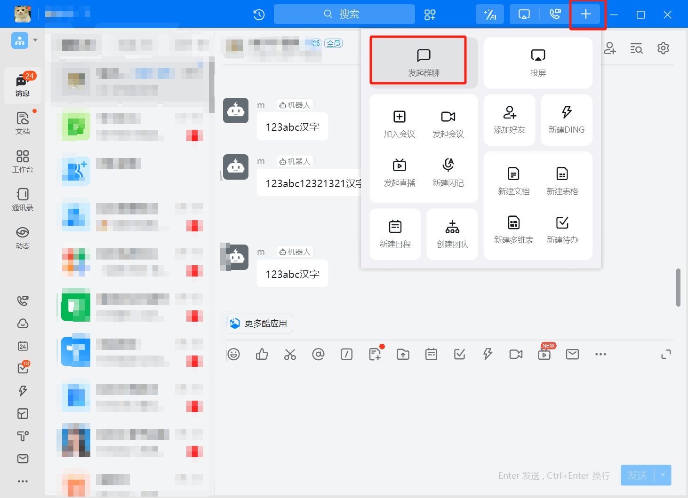
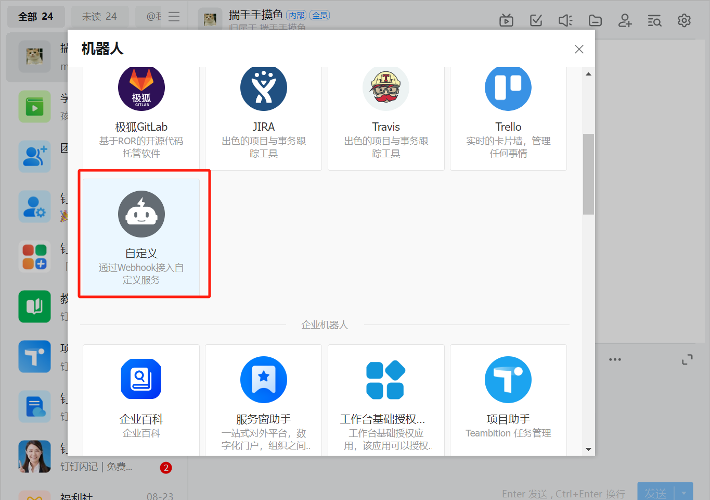
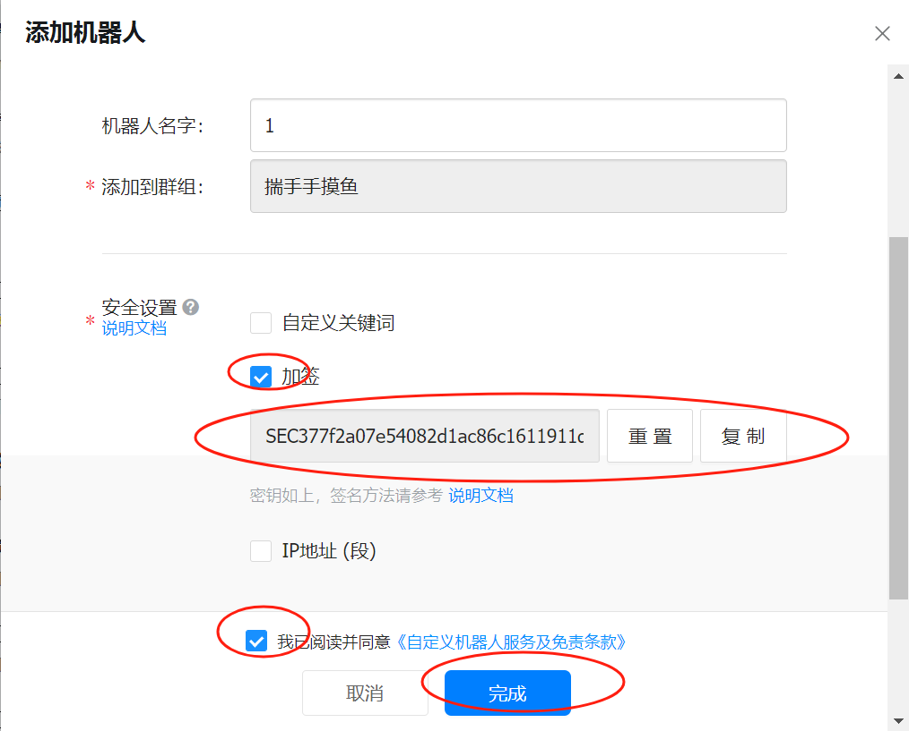
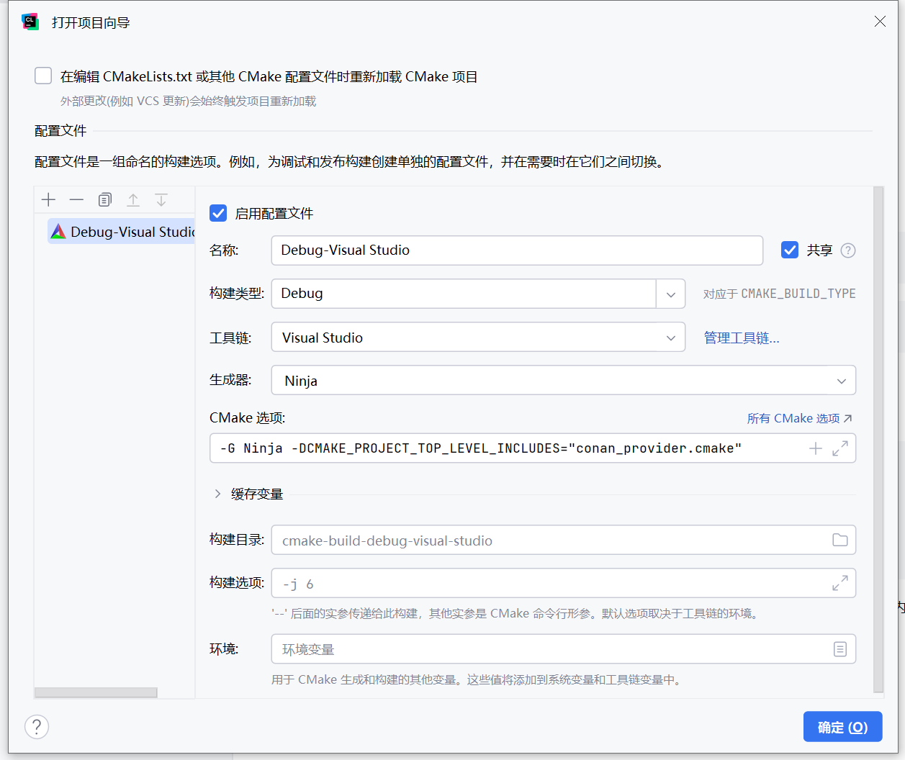

# 说明

本程序构建生成为MetatTrader 4/5提供发送消息的动态库(DLL)

目前只支持发送到钉钉，后续将支持微信飞书等等

这只是一个dll，对接MT4、MT5部分还没写!!

star多继续写，点点star！！

## 使用：

创建一个群聊



之后 群设置->机器人->添加机器人->自定义机器人->勾选加签





加签 SEC开头的一串要复制下来

点完成之后会有一个网址也要复制下来粘贴到代码里面

https://open.dingtalk.com/document/robots/custom-robot-access

# 构建

程序使用conan包管理工具，可以使用pip install conan安装

```bash
pip3 install conan
```

## 方法一：clion构建

如果MinGW无法构建，安装Visual Studio，用clion调用Visual Studio的工具链。

cmake选项：

```C
-G Ninja -DCMAKE_PROJECT_TOP_LEVEL_INCLUDES="conan_provider.cmake"
```




## 方法二 ：手动构建


```bash

if exist build rmdir /s /q build
mkdir build
cd build
cmake .. -G Ninja -DCMAKE_PROJECT_TOP_LEVEL_INCLUDES="conan_provider.cmake"

```
解释：

- if exist build：检查 build 目录是否存在。
- rmdir /s /q build：如果存在，删除 build 目录及其所有内容。
- /s：删除指定目录及所有子目录和文件。
- /q：静默模式，不提示确认。
- mkdir build：重新创建 build 目录。

使用 Ninja 构建项目


## MQL使用：

### MQL5：

```c
#property description "--------------------------------"
#property copyright "揣手手"
#property version "1.0"
#ifndef P
#define P(X) Print(#X, " = ", X)
#endif

// 换成你自己的路径，如在MQL5的Libraries路径下可以使用相对路径
// 此处我MQL5文件夹下有message，message里含有MetaTraderMessageShare.dll
// 此处也可用相对路径 如 "D:/xxxx/MetaTraderMessageShare.dll"
#import "message/MetaTraderMessageShare.dll" //换成你自己的路径，或者在MQL的include路径下可用相对路径 如 "D:/ttttt/MetaTraderMessageShare.dll"
string SendDingTalkMessageForMQL(string url, string sec, string msg);
#import
string URL = "https://oapi.dingtalk.com/robot/send?access_token=xxxx";
// string URL = "http://127.0.0.1:7899/robot/send?access_token=xxxx";
string SECRET = "SECxxxx";
string msg = "123abc测试消息\n";

void OnStart() {
    string ret = SendDingTalkMessageForMQL(URL, SECRET, msg + readableLocalTime());
    P(ret);
}

/**
 * 返回当前时间 2024.08.20 20:03:03 (UTC+8)
 * @return ( string ) 返回当前时间 2024.08.20 20:03:03 (UTC+8)，若有误差超1s，追加 "时间不准确"
 */
string readableLocalTime() {
    datetime utcTime = TimeCurrent(); // 获取当前UTC时间
    datetime localTime = TimeLocal(); // 获取本地时间

    // 计算时区偏移，允许两秒误差
    int timeZone = (int)MathRound((localTime - utcTime) / 3600.0);
    string readableLocalTime = TimeToString(localTime, TIME_DATE | TIME_MINUTES | TIME_SECONDS);
    string sign = timeZone > 0 ? "+" : (timeZone < 0 ? "-" : "-0");

    // 拼接时间与时区信息
    string result = readableLocalTime + " (UTC" + sign + IntegerToString(MathAbs(timeZone)) + ")";

    // 计算时间误差 1（秒）如果存在误差，追加 "时间不准确"
    int timeDifference = (int)MathAbs(localTime - utcTime);
    if(timeDifference % 60 > 1) {
        result += " UTC与本地时间不准确,相差 " + IntegerToString(timeDifference - timeZone * 3600) + " 秒\n";
    }

    return result;
}

```

### mql4：

```bash
#property description "--------------------------------"
#property copyright "揣手手"
#property version "1.0"

#ifndef P
#define P(X) Print(#X, " = ", X)
#endif

// 换成你自己的路径，如在MQL4的Libraries路径下可以使用相对路径
#import "message/MetaTraderMessageShare.dll" //换成你自己的路径，或者在MQL的include路径下可用相对路径
string SendDingTalkMessageForMQL(string url, string sec, string msg);
#import

string URL = "https://oapi.dingtalk.com/robot/send?access_token=xxxx";
string SECRET = "SECxxxx";
string msg = "123abc测试消息\n";

void OnStart() {
    string ret = SendDingTalkMessageForMQL(URL, SECRET, msg + readableLocalTime());
    P(ret);
}

/**
 * 返回当前时间 2024.08.20 20:03:03 (UTC+8)
 * @return ( string ) 返回当前时间 2024.08.20 20:03:03 (UTC+8)，若有误差超1s，追加 "时间不准确"
 */
string readableLocalTime() {
    datetime utcTime = TimeGMT();
    datetime localTime = TimeLocal();

    int timeZone = (int)MathRound((localTime - utcTime) / 3600.0);
    string readableLocalTime = TimeToString(localTime, TIME_DATE | TIME_MINUTES | TIME_SECONDS);
    string sign = timeZone > 0 ? "+" : (timeZone < 0 ? "-" : "-0");

    // 拼接时间与时区信息
    string result = readableLocalTime + " (UTC" + sign + IntegerToString(MathAbs(timeZone)) + ")";

    // 计算时间误差1（秒），如果存在误差，追加 "时间不准确"
    int timeDifference = (int)MathAbs(localTime - utcTime);
    if(timeDifference % 60 > 1) {
        result += " UTC与本地时间不准确, 相差 " + IntegerToString(timeDifference - timeZone * 3600) + " 秒\n";
    }

    return result;
}

```


## 注意

本dll禁用了HTTPS 的校验，若想启用需要更改如下代码

MetaTraderMessageShare/src/DingTalk/DingTalkSender.cpp

```C
// 不验证对等证书        
curl_easy_setopt(curl, CURLOPT_SSL_VERIFYPEER, 0L); 
// 不验证主机
curl_easy_setopt(curl, CURLOPT_SSL_VERIFYHOST, 0L); 
        //更改为
// 验证对等证书
curl_easy_setopt(curl, CURLOPT_SSL_VERIFYPEER, 2L); 
// 验证主机
curl_easy_setopt(curl, CURLOPT_SSL_VERIFYHOST, 2L); 
```

同时需要指定证书路径有效

下面是从 Mozilla 提取的 CA 证书https://curl.se/docs/caextract.html

默认文件cacert.pem和MetaTraderMessageShare.dll在同级目录内
